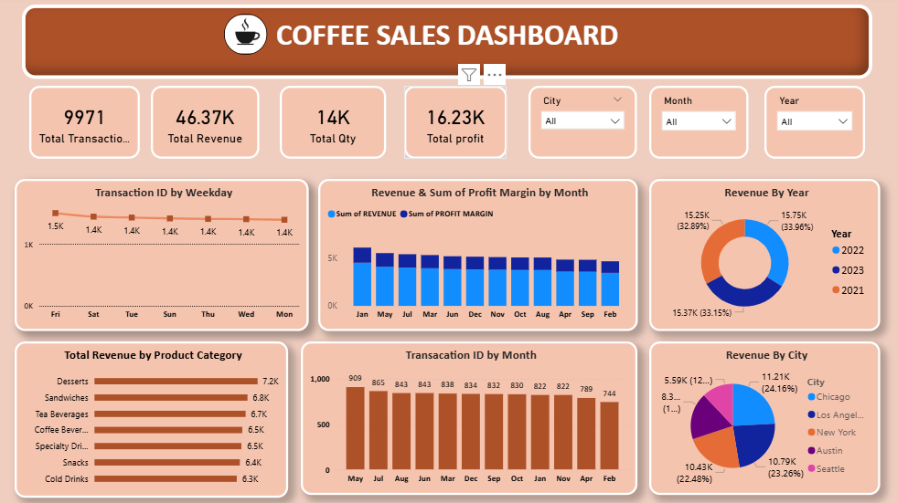

### ☕ Coffee Sales Dashboard – Power BI

### 📌 Project Overview :

The Coffee Sales Dashboard is an interactive Power BI report designed to analyze coffee shop sales performance. It provides insights into revenue, profit, transactions, product categories, cities, and monthly sales trends, helping stakeholders make data-driven business decisions.

### 📊 Dashboard Preview :

### 🎯 Key Objectives :

Monitor overall sales performance.

Track revenue, profit, and quantity sold.

Analyze sales trends across months and years.

Identify top-performing product categories.

Compare city-wise sales performance.

Understand transaction patterns by weekdays.

### 📈 Key Performance Indicators (KPIs) :

KPI	Value

Total Transactions	9,971

Total Revenue	46.37K

Total Quantity Sold	14K

Total Profit	16.23K

### 📌 Dashboard Features :

🔹 Sales Overview

Total Revenue

Total Profit

Total Quantity Sold

Total Transactions

🔹 Revenue Analysis

Revenue by Month

Revenue by Year

Profit Margin Trends

🔹 Product Performance

Revenue by Product Category

Best-Selling Categories

Category Comparison

🔹 Location Analysis

Revenue by City

City-wise Sales Distribution

🔹 Transaction Analysis

Transactions by 

Monthly Transaction Trends

🔹 Interactive Filters

City Filter

Month Filter

Year Filter

### 🛠️ Tools & Technologies Used :

📊 Power BI Desktop

📁 Microsoft Excel / CSV Dataset

📈 Data Modeling

📉 DAX Measures

🎨 Dashboard Design & Visualization

### 📊 Insights Generated :

✅ Revenue exceeded 46K

✅ Total Profit reached 16K

✅ Nearly 10K Transactions recorded

✅ Product categories contributed differently to revenue generation

✅ Sales performance varied across cities

✅ Monthly revenue trends help identify seasonal demand patterns

### 💡 Business Benefits :

Improves sales monitoring. 

Identifies profitable products and locations.

Supports strategic decision-making.

Helps track business growth trends.

Provides actionable insights through visualization.

### 👨‍💻 Author : sushant shilimkar

📧 Email:sushantshilimkar005@gmail.com

🔗 LinkedIn: https://www.linkedin.com/in/sushant-shilimkar-24b7a2351?utm_source=share_via&utm_content=profile&utm_medium=member_android

💻 GitHub: https://github.com/sushantshilimkar005-ship-it